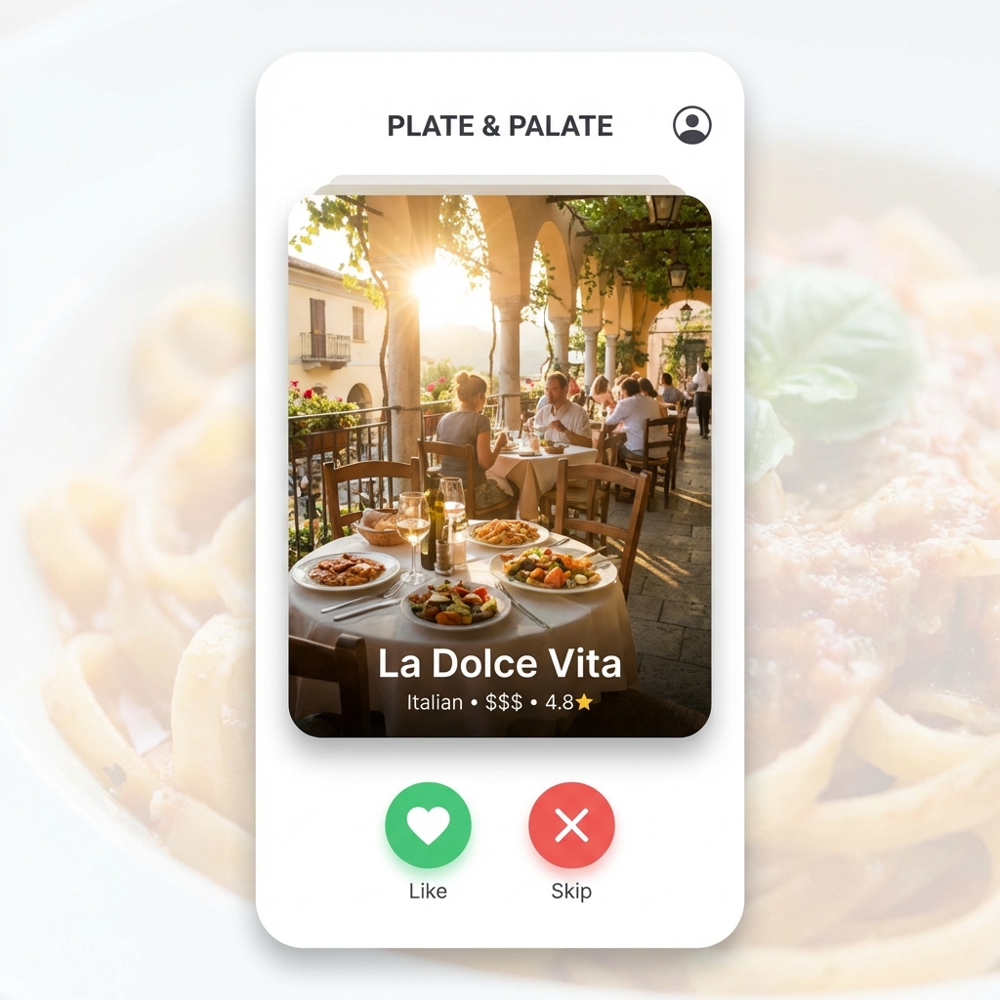
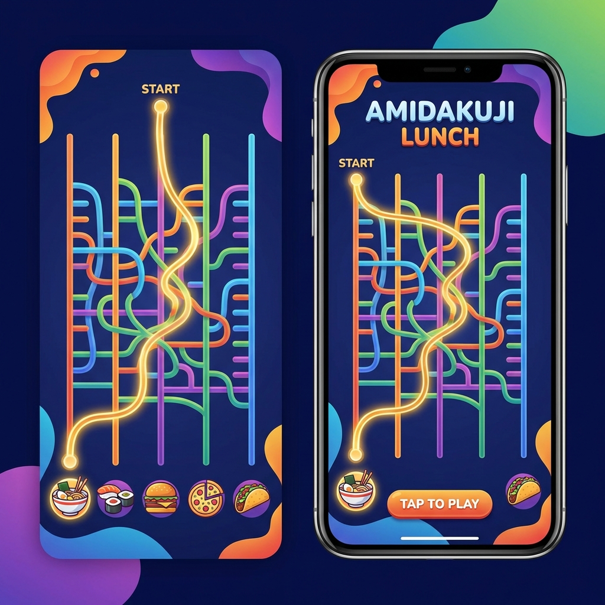
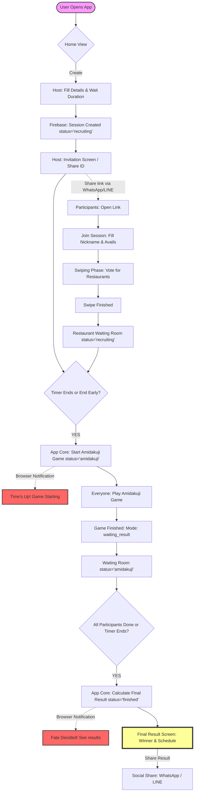

# 🥗 GatheringFun

**GatheringFun** is a modern, real-time web application designed to help friends decide where and when to eat without the stress of endless group chat debates. Combining Tinder-style swiping with the classic Amidakuji (Ghost Leg) decision game, it turns organizing a dinner party into a fun, interactive experience.

<p align="center">
  
</p>

<p align="center">
  
  
</p>

---

## ✨ Key Features

### 🕒 Smart Scheduling
- **Custom Time Slots**: Hosts can define up to 5 specific time periods (e.g., `18:00 - 20:00`).
- **Schedule Matcher**: Automatically analyzes all participant availability to find the most popular Date and Time for the group.

### 🍽️ Restaurant Discovery
- **Real-time Search**: Powered by the **Google Places API (New)** to find the best spots in your chosen area.
- **Tinder-Style Swiping**: Swipe right to "Like" and left to "Skip" restaurants based on group preferences.
- **Popularity Ranking**: Tracks real-time results to show which restaurants the group loves most.

### 🎮 The "Chosen One" Game
- **Amidakuji (Ghost Leg)**: A fair and fun way to make the final decision. The top restaurants from the swiping phase are entered into a path-based game of luck.
- **Instant Sync**: Everyone watches the game unfold in real-time, synchronized across all devices.

### 🔔 Phase Reminders & Sharing
- **Browser Notifications**: Automatic countdown alerts for both host and participants when a phase ends.
- **Host Control Center**: A dedicated sharing toolbar for the host to instantly nudge friends via **WhatsApp** or **LINE**.
- **Context-Aware Messages**: Pre-filled sharing messages that adapt based on the current phase (Joining, Voting, or Results).

### 📅 Seamless Integration
- **Google Maps**: One-click navigation to the winner.
- **Google Calendar**: Instantly sync the winning restaurant, date, and time to your schedule.

---

## 🛠️ Tech Stack

- **Frontend**: [React 19](https://react.dev/) + [Vite](https://vitejs.dev/)
- **Styling**: [Tailwind CSS 4](https://tailwindcss.com/) + [Framer Motion](https://www.framer.com/motion/)
- **Icons**: [Lucide React](https://lucide.dev/)
- **Backend & Database**: [Firebase](https://firebase.google.com/) (Firestore & Anonymous Auth)
- **Place Data**: [Google Places API (New)](https://developers.google.com/maps/documentation/places/web-service/overview)

---

## 🚀 Getting Started

### 1. Prerequisites
- Node.js (Latest LTS recommended)
- A Firebase project
- A Google Cloud API Key (with Places API enabled)

### 2. Installation
```bash
# Clone the repository
git clone [your-repo-url]

# Enter the directory
cd GatheringFun

# Install dependencies
npm install
```

### 3. Configuration
Create a `.env` file in the root directory and add your credentials:
```env
VITE_FIREBASE_API_KEY=your_key
VITE_FIREBASE_AUTH_DOMAIN=your_domain
VITE_FIREBASE_PROJECT_ID=your_id
VITE_FIREBASE_STORAGE_BUCKET=your_bucket
VITE_FIREBASE_MESSAGING_SENDER_ID=your_id
VITE_FIREBASE_APP_ID=your_id
VITE_GOOGLE_MAPS_API_KEY=your_google_key
```

### 4. Running Locally
```bash
npm run dev
```

---

## 📄 License
This project is for personal use and portfolio demonstration. Feel free to explore and build upon the logic!

---

## 🗺️ Application Logic Flow


